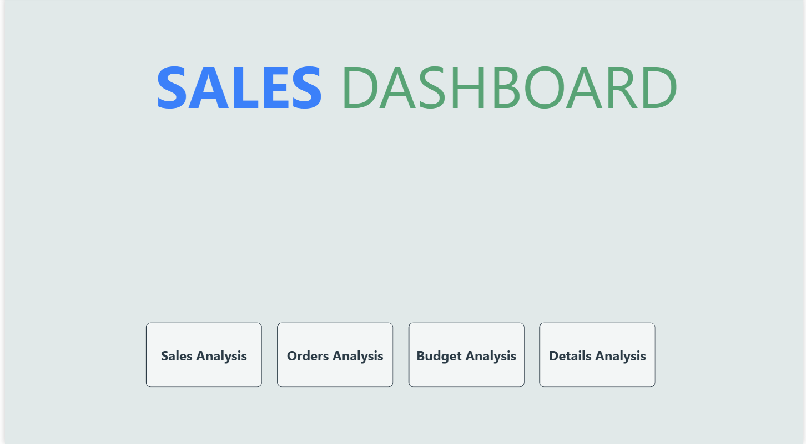
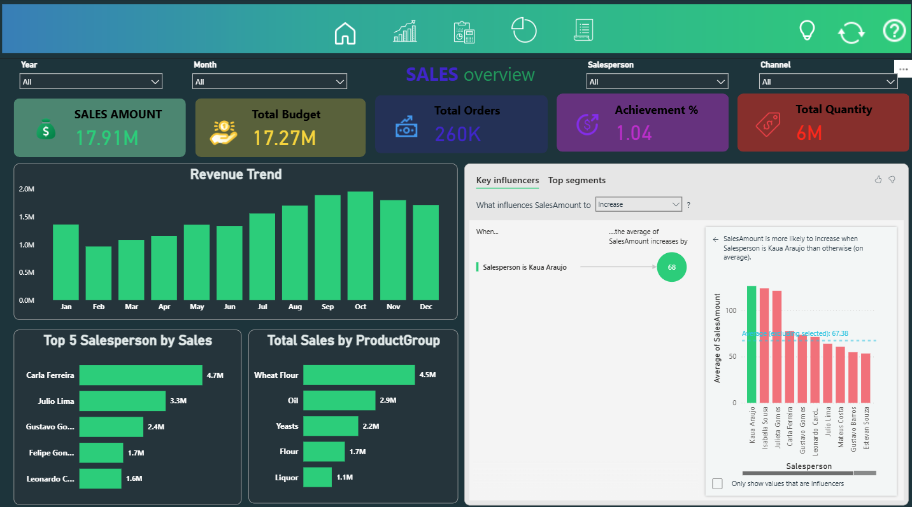
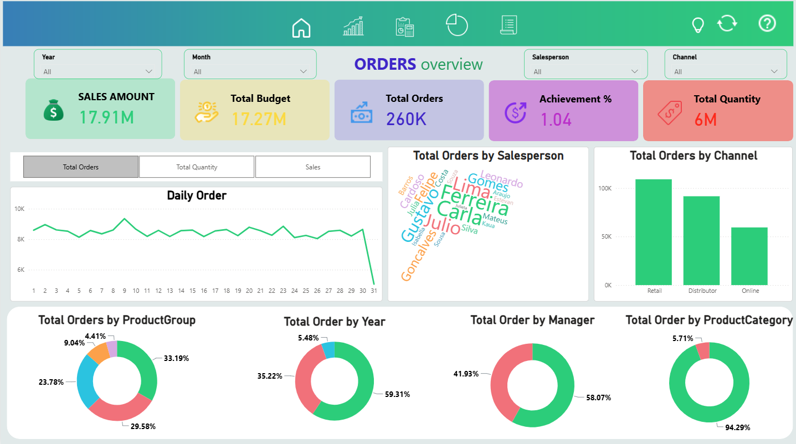
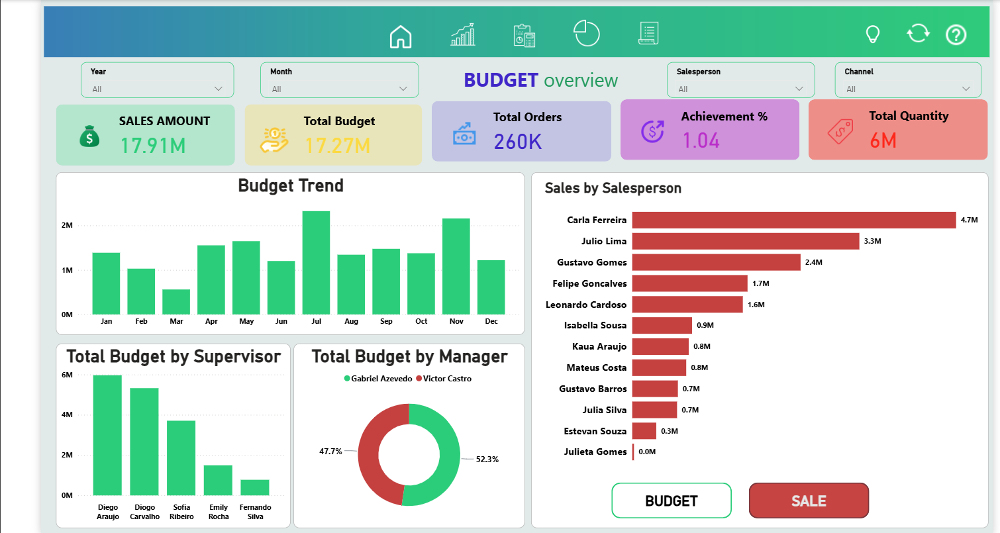
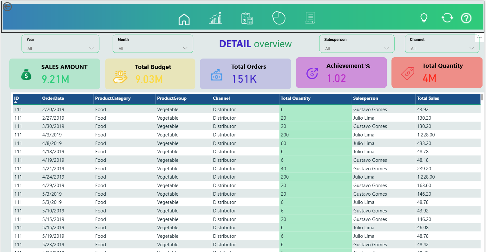
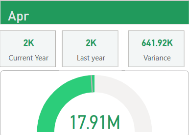

# Power BI Sales & Budget Performance Dashboard

## Project Overview

This Power BI project analyzes sales performance against budget targets. It helps users monitor sales, orders, product performance, salesperson performance, and budget achievement.

## Dashboard Screenshots

### Home Page

### Sales Overview

### Orders Overview

### Budget Overview

### Transaction Details

### Monthly KPI Gauge

## Key Performance Indicators

- Total Sales Amount
- Total Budget
- Budget Achievement Percentage
- Total Orders
- Total Quantity
- Sales and Budget Variance

## Dashboard Features

- Interactive filters for year, month, salesperson, and channel
- Sales and revenue trend analysis
- Budget-versus-actual performance tracking
- Product and sales-channel analysis
- Salesperson performance rankings
- Transaction-level drill-through
- Dynamic KPI and gauge visuals

## Tools and Technologies

- Microsoft Power BI
- DAX
- Power Query
- Data Modeling
- Data Visualization
- Microsoft Excel

## Download Project Files

- [Download the Power BI Dashboard](Power-BI-Sales-Budget-Dashboard.pbix)
- [View the PDF Documentation](Power-BI-Sales-Budget-Documentation.pdf)
- [Download the Word Documentation](Power-BI-Sales-Budget-Documentation.docx)

## How to Use the Dashboard

1. Download the `.pbix` file.
2. Install or open Microsoft Power BI Desktop.
3. Open the downloaded `.pbix` file.
4. Use the filters, navigation buttons, and interactive visuals to explore the report.

## Author

**Ibraheem Sule**  
Senior Business Intelligence Developer | Power BI Developer  

[View My LinkedIn Profile](https://www.linkedin.com/in/ibraheemsule/)

